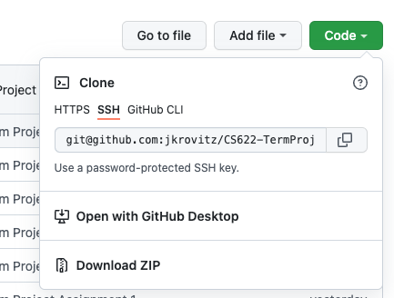
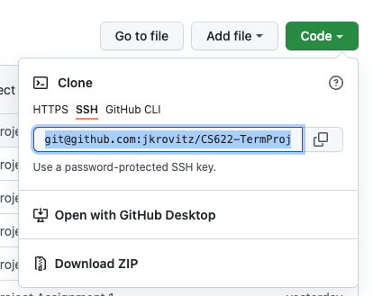

# LibraryManagementSystem (LMS)

- [How to Run](#how-to-run)

## How to Run
1. From Github, click the Code dropdown.



2. Copy the SSH link.
<br/>


3. In the command-line or terminal, type the following:
```bash
git clone <copied ssh link>
```

4. Once the repository is cloned, in the editor/IDE of your choice open the directory as a Maven Project and install the dependencies. 


5. The file <em>file src/main/java/edu/bu/jkrovitz/console/MainMenu.java</em> contains the `main()` method that is used to run the program.


